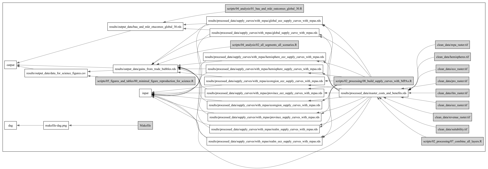

# Repository for: A market for 30x30 in the ocean
## By: Juan Carlos Villaseñor-Derbez, Christopher Costello & Andrew Plantinga

> Please note this repository contains multiple branches.

## Reproducibility

The project was built using R in RStudio. All data and code needed to reproduce figures and tables in our paper is included in this repository. There are two ways you can interact with our materials.

### To replicate our main results:
- Through RStudio: For a minimal reproduction example is found under [`scripts/04_analysis/00_minimal_reproduction_EXAMPLE.R`](https://github.com/jcvdav/transferable_conservation/blob/master/scripts/04_analysis/00_minimal_reproduction_EXAMPLE.R). The main script for a full reproduction of our results is found under [`scripts/04_analysis/02_all_segments_all_scenarios.R`](https://github.com/jcvdav/transferable_conservation/blob/master/scripts/04_analysis/02_all_segments_all_scenarios.R). The Science team requested our raw data and they generated the figure in the main text. If you want to replicate those, we've provided the script found in [`scripts/05_figures_and_tables/00_minimal_figure_reproduction_for_science.R`](https://github.com/jcvdav/transferable_conservation/blob/master/scripts/05_figures_and_tables/00_minimal_figure_reproduction_for_science.R).
- Through the command line: Alternatively, the project also has a [`Makefile`](https://github.com/jcvdav/transferable_conservation/blob/master/Makefile) that outlines the relation between input files, scripts, and output files needed to reproduce our main results. To reproduce them, simply type `make -B` in your command line of preference. See below for a DAG representation of the makefile.

### If you want to replicate everything (supplementary figures and tables, robustness tests, etc...):
The repository is set-up with `renv` package manager. You should be able to have an identical copy of the R packages used here by running `renv::activate()` followed by `renv::restore()`. Note that the `.Rprofile` file will attempt to source a script that loads some default options and values into the environment upon start-up (assuming you are running RStudio). Feel free to source it yourself, or remove it from the pipeline. You can then explore and run scripts independently.

## Data

- Some raw data are available (in `raw_data`) when it was below GitHub's 100 MB size limit. Otherwise, the data are added with GitHub Large File Storage. If you have any trouble accessing them, we're also happy to provide these data directly. Simple e-mail me at `juancarlos@ucsb.edu`. Please indicate if you have a preferred delivery method.

- Input data are provided in the `clean_data` folder.

- Our output data (supply curves, trade equilibrium etc) are all found under `results` (either `output_data` or `processed_dats`).

- There is a csv file, requested by Science, which contains the data required to produce Figure 1 of the main paper.

---------
