```{r setup, include=FALSE}
knitr::opts_chunk$set(echo = FALSE,
                      warning = FALSE,
                      message = FALSE,
                      fig.pos = "!H",
                      out.extra = "")
```

\clearpage

# Important sentences

Importantly, the quality of a patch can be defined independently of other pixels. This is true for habitat suitability, in which the abiotic characteristics that determine the suitability of a patch are independent of the protected status of any patch.

It is important that we acknowledge the equity concerns of any conservation intenrvention. Under the current approach to conservation, nations face two options: to conserve 30% in situ, or not engage in conservation at all. This market-based approach allows for a third option: it allows nations to decide how much to conserve in their waters.

Ocean grabbing, the term that relates to the loss of soveraignty in the ocean (see Benett) may be perceived as a problem. However, nations are not forced to conserve in situ, and will only do so if they are approrpiately compensated for it.

All ecosystems are euqlly important for the subsistance of nature and species that reside in them. But a coral reef is not comparable to a kelp forest.  A market design that doesn't acknowledge these differences may unintendendly bias conservation towards different ecosystems or geographic regions. When outcomes of a market are restricted to a geographic extent, such as air pollution markets, a buble policy is implemented. We borrow from this principle and use biogeographic regionalization principles to create ecologically-coherent market segments where nations trade similar habitat. For example, in the temperate eastern pacific, Mexico and the US will trade a same type of habitat, while in the Tropical Atlantic they wil.

Having tackled these three limitations (spatially-independent measure, x, and market bubbles), we proceed to simulate the trade outcomes of such a market. We evaluate the outcomes across a range of target coverages (1 - 100), and find that a market always results in reduced costs. The absolute and relative magnitude of the costs-savings changes with protection target, peaking at between X and Y, depending on of the choice market segmentation. Intuitively, increasing teh number of market segments reduces the opportunity for bargaining and reduces the gains from trade, but ensures the persistance of different habitats.

We pay especial attention to goals of interest, such as protecting 30% of the marine area (habitat suitability-weighted) within all national jurisdictions. We find that a market-based approach to conservation would reduce costs by X%, and that Y% less area would be needed.

# Introduction

Nations have committed to protect a fixed portion of their EEZs in order to reduce and control anthropogenic impacts in the marine environment. Aichi target 11^[Aichi target 11 states that by 2020 10% of coastal and marine areas should be conserved through protected areas.] and target 14.5 of the United Nations Sustainable Development Goals^[Similarly, target 14.5 of the United Nations Sustainable Development Goals is to conserve at least 10% of coastal and marine areas.] aim to protect 10% of coastal and marine areas. Some more ambitious goals call for 30%, such as that from the World Parks Congress^[the International Union for the Conservation of Nature (IUCN) has suggested that at least 30% of each marine habitat should be protected in areas with no extractive activities.].

These goals ultimately aim to protect a global amount of biodiversity by spatially abating risks. However, costs and benefits are heterogeneous in space, and even conservation-minded countries might struggle to meet these targets if costs are prohibitive. But what if a nation could pay to conserve elsewhere, where the costs are lower? This setup is similar to that of pollution abatement in a multi-firm setting. A large body of theoretical and empirical literature has shown that an efficient way to achieve a level of pollution abatement is by leveraging differences in firm's marginal cost curves and incentivizing trade of emission permits.

Just as any two firms are capable of reducing their emissions by a given amount, two nations are capable of implementing MPAs with the same biodiversity value. However one nation (or firm) may be able to do so at a lower cost. A market approach may be the most efficient (*i.e.* cost-effective) way of balancing these differences in costs and benefits, and ultimately allow us to reach the desired targets at a reduced cost.

Under such a market, what would be the gains from trade? For the same amount of conservation as in the BAU scenario, how much are the costs reduced? How does spatially dividing the market (say, by ecosystem or ocean) change the outcome? This are indeed the questions that I seek to answer.

# Methods

We combine data on biodiversity benefit and costs to generate supply curves for each nation, as well as a global biodiversity supply curve. While in practice this approach can be used for any given biodiversity target, I produce an example using the 30% area-based target (*i.e.* We translate this area-based target into biodiversity units). We then find the trading price in the global supply curve and use the country-level supply curves to calculate in-situ and ex-situ conservation for every country. We can then calculate the differences in costs, and estimate the gains from trade.

The same approach can then be repeated for any level of spatial aggregation. As an example, I repeat the conservation excercise by subdividing the world into 12 Realms, and calculate realm-level supply curves to estimate the trading price for all countries that are part of that market.

The following sections go into more detail to describe my methods. The first section describes the data, and important caveats are mentioned at this stage. The second section describes how nation-level and aggregate supply curves were built. The third section dives into translating area-based targets into biodiversity benefit targets and the corresponding trading prices. Finally, we discuss how the analysis can be replicated by creating markets at different spatial scales.

## Spatial considerations

When combining different data sources, we also include pixel-level information about the Hemisphere, Realm, Province, and Ecoregion in which they reside. This allows us to repeat the exercise of finding supply curves for any level of spatial division in order to simulate markets within them. This is better described in the results section, where I present detailed methods and results in parallel.

# Results

The main purpose of this project is to identify the gains from trade. But in order to get there, there are other minor findings that are worth mentioning here. This sections presents some preliminary results. The first section shows findings for a global market, where I calculate the gains from trade for a given target and it's corresponding trading price. I then turn to the realm-level markets, and present the same information for each realm. Whenever relevant, I mention opportunities for improvements, and I later discuss them in the discussion section.

## Global

By combining costs and benefits of conservation and anticipating the ways in which countries may conserve within their waters, we can translate the (percent) area-based targets into biodiversity benefit targets. We find that a 30% target yields a global biodiversity benefit of 3 to 106, depending on the approach taken (Figure \ref{fig:eez-supply-curve-approaches}; Table \ref{tab:trading-prices}).


\newpage

Our global supply curve allows us to take any biodiversity target and find its corresponding costs. In doing so, we can identify the trading price for any possible target. We find that the trading price for conservation lies between 0.08 and 483,528^[I must stress that these figures represent losses in fisheries landings, not dollars, and that more work needs to be done.]. Figure \ref{fig:global-conservation-targets-and-trading-prices} shows the corresponding trading prices for each of the targets outlined above. Table \ref{tab:trading-prices} shows the five targets and their trading prices. While these figures and table show only the values for the five approaches mentioned above, the same can be done for any given biodiversity target.

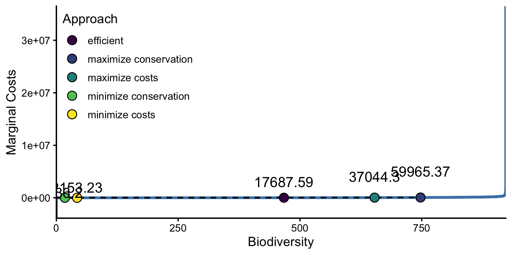

\input{results/tab/trading-prices.tex}

\newpage

In translating the area-based target into a biodiversity benefit target we identified the global conservation benefits, but also the costs to each nation (Figure \ref{fig:equilibrium-supply-curves} left). We can use the nation-level supply curves and trading price to find the market's equilibrium for conservation (Figure \ref{fig:equilibrium-supply-curves} right). Under a market-based approach, in-situ conservation will decrease for some nations (those for which costs are higher than the trading price), while some may see increased in-situ conservation (those under the trading price). The additional conservation in some nations (red lines in Figure \ref{fig:equilibrium-supply-curves}) can only be achieved through a market, where nations whose in-situ conservation would exceed the trading price are willing to pay to conserve elsewhere.


By knowing the equilibrium under each approach we can compare the total costs and calculate the gains from trade. We find that a market-based approach can produce the same biodiversity benefit of 71.56 units for just 54% of the costs (Table \ref{tab:gains-from-trade}). Of course, gains from trade are heterogeneously distributed among nations. The map below (Figure \ref{fig:map-of-trade}) shows which countries would rather pay to conserve elsewhere, and which countries get paid to conserve in-place. Figure \ref{ref:two-states-map} shows the outcome of each approach.

\input{results/tab/gains_from_trade.tex}


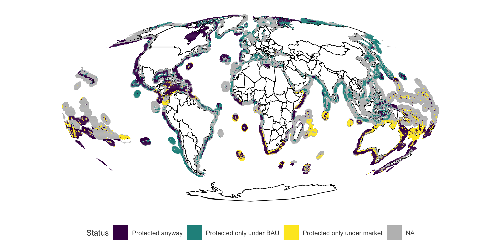

\newpage

## Realms

The results presented so far assume that a unit of biodiversity is worth the same anywhere around the world. However, we might want to ensure that no single type of habitat or region is left out. To overcome this, markets can be established at different spatial scales. Here, we use different scales of zoning in the marine environment (*i.e.* Biogeographic zoning). \citet{spalding_2007} divided the oceans using a hierarchical approach with Realms (n = 12) containing Provinces (n = 60), which in turn contain Ecoregions (n = 219).

The same approach as above can be repeated for any level of spatial aggregation that allows for more than one country. For example, this can be done for each of the 12 realms (Figure \ref{fig:realm-map}). Each Realm contains more than one nation, which would allow for trade to occur (Figure \ref{fig:eezs-per-realm}). For example, the Tropical Atlantic contains more than 60 nations, while Temperate Australasia contains just three. Any given country may also be part of more than one realm (Figure \ref{fig:realms-per-eezs}). For example, Mexico is present across four realms (Tropical Eastern Pacific, Temperate Northern Pacific, Temperate Northern Atlantic, and Tropical Atlantic).

As done before for the global analysis, we can generate the biodiversity supply curves of each country-realm combination, and calculate the realm-level supply curve for biodiversity benefit. Then, for any desired level of biodiversity benefit, we can estimate the realm-specific trading price, and derive the market equilibrium. From there, we can estimate the gains from trade, and identify who gains from this approach.

We first must find the target amount of biodiversity. We do this by finding how much biodiversity would be protected if every country were to protect 30% of each realm present within their Exclusive Economic Zone ^[This is more closely aligned with what the IUCN 30% target is: the International Union for the Conservation of Nature (IUCN) has suggested that at least 30% of each marine habitat should be protected in areas with no extractive activities.]. We then sum the realm-level biodiversity to obtain the aggregate biodiversity (Table \ref{tab:rlm-trading-prices}). Using the realm-level supply curves (Figure \ref{fig:eez-rlm-supply-curve} bottom) we can identify the trading prices. When the market is segmented by realms, a market approach produces the same amount of conservation for just 65.2% of the costs in the BAU scenario. The realm-level gains from trade for such a market are shown in Table \ref{tab:rlm-gains-from-trade}, and Figure \ref{fig:rlm-map-of-trade} shows the realm-level transactions. Note how for the Temperate Northern Pacific Mexico gets paid to conserve, while in the Tropical Atlantic it pays to conserve elsewhere.


So far, I have performed preliminary analyses for a global market and outlined how it would be done for 12 realms. I believe there is room (and need) to try a few more approaches. The first approach would involve "zooming out" to create four markets, one for each hemisphere. The second approach would then increase the scale by repeating the exercise for each ocean basin. Then, I would further increase the scale by taking the market at the province-level (Figure \ref{fig:eezs-per-province}). Doing it at the ecoregion-level (the next biogeographical scale) would yield less benefits from trade, since many Ecoregions contain only one nation. I expect gains from trade to decrease as spatial resolution (or segmentation of the markets) increases. In the end I will have six levels of spatial aggregation: global, hemisphere, ocean, realm, province, and EEZ (BAU). 


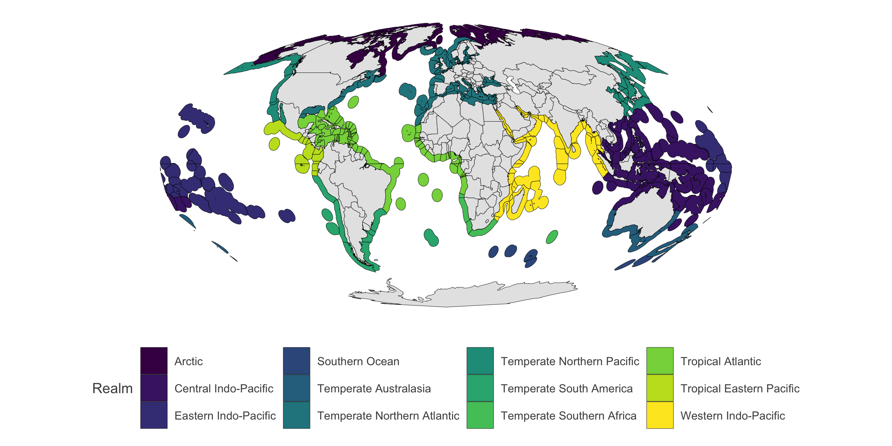


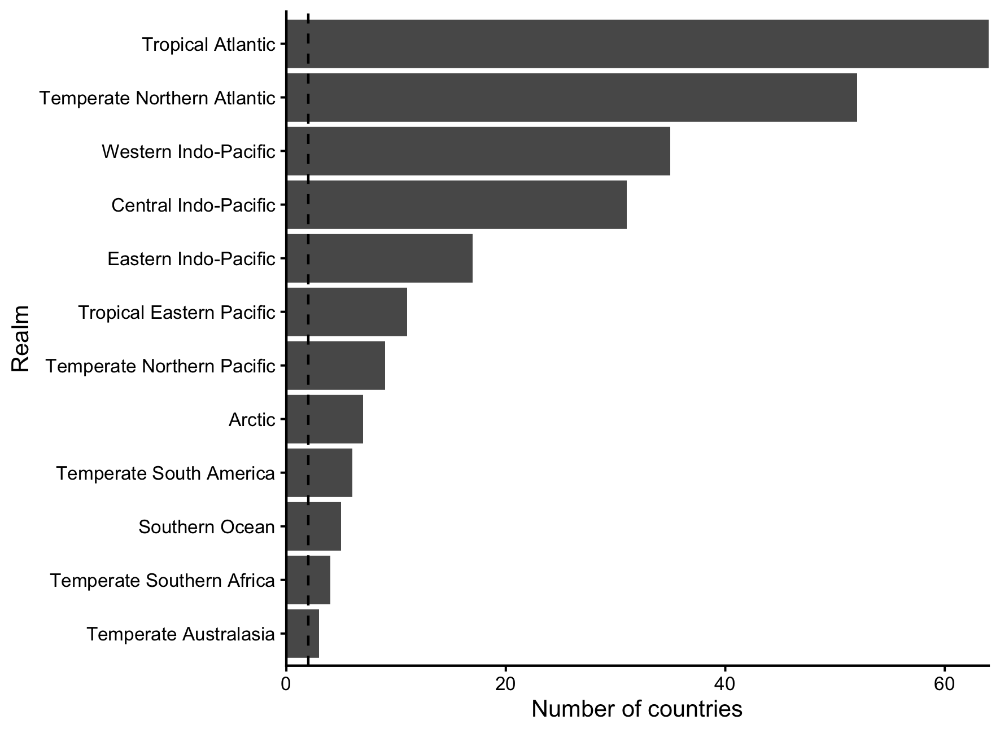


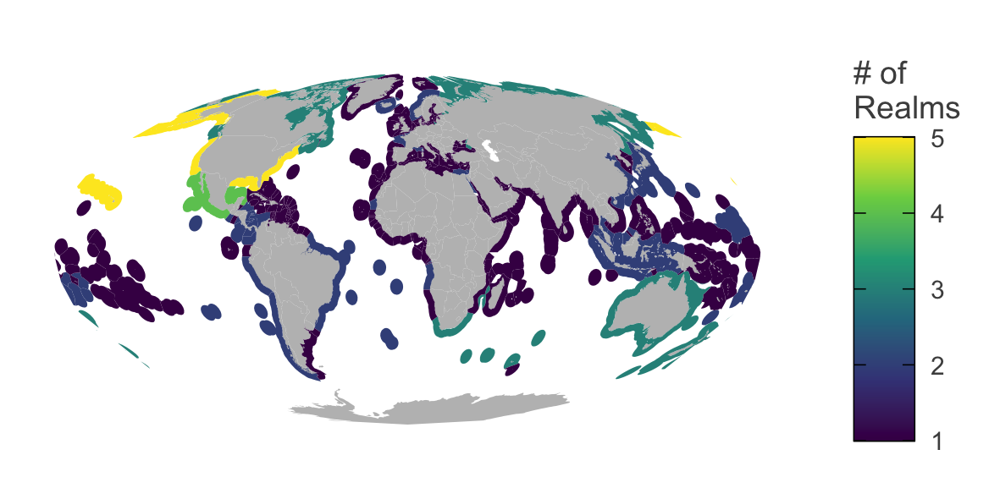


\input{results/tab/trading_prices_rlm.tex}

\input{results/tab/gains_from_trade_rlm.tex}


\newpage

# Other figures and tables

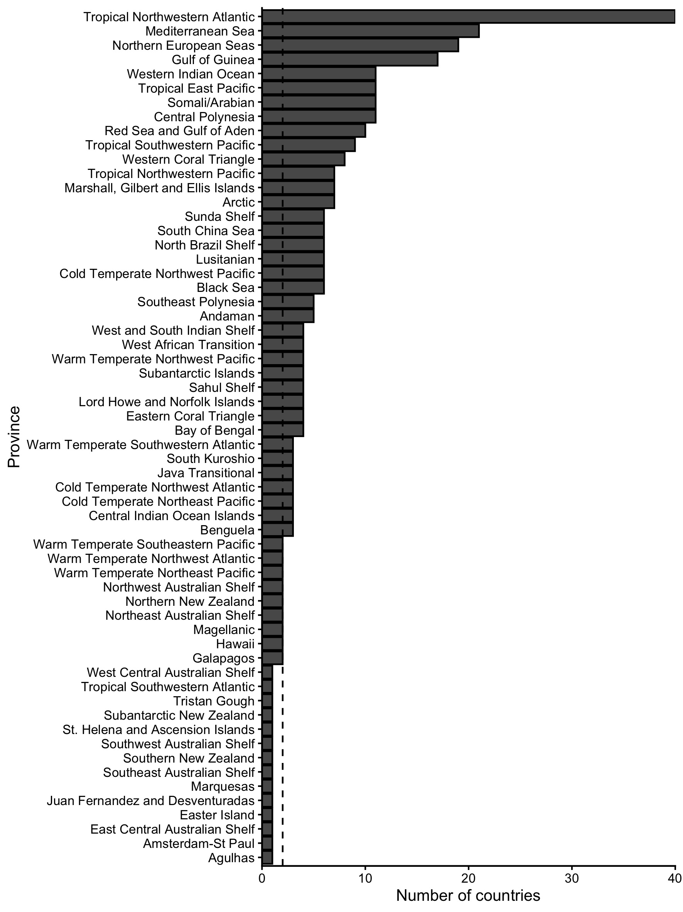

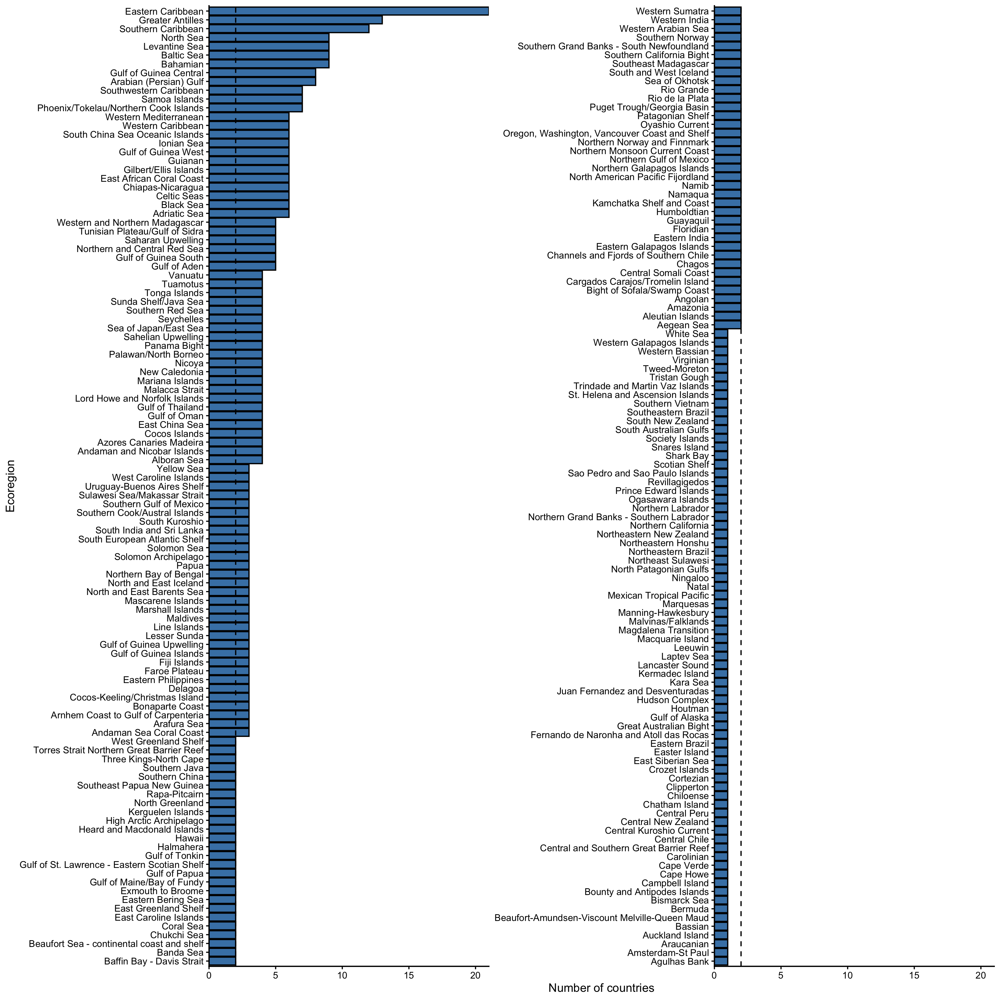

\clearpage

# Supplementary Information

## Data description

We must first identify the costs and benefits of conservation. Conserving biodiversity may provide benefits to society. For example, areas with higher species richness and biomass are more attractive to tourism \citep{williams_2000}. Species richness also leads to increased stability of ecosystems \citep{tilman_1995}, and may reduce exposure to pathogens \citep{lamb_2017}. The quantification is not straightforward, but we can assume that biodiversity indices are positively correlated with their benefits they provide (although saturation may occur past a given point).

I use spatially-explicit data on biodiversity benefit for each 50 X 50 km grid in the ocean. The score was derived to account for species richness and evolutionary distinctiveness, but also presence of topographic features (*e.g.* sea mounts). Figure \ref{fig:biodiversity-ranking} shows a global map of these values. The value of a given pixel (termed $\Delta v$) depends on previously protected pixels. As such, the value of a randomly chosen pixel is more or less meaningless. However, the configuration represented in Figure \ref{fig:biodiversity-ranking} was derived to maximize biodiversity. Therefore, protecting the best $n$ pixels and summing their values does represent the total amount of biodiversity protected. The same exercise has been done at the country-level (This is an important consideration for target calculations mentioned below. While I will use this global data for the purposes of motivating my approach, I do plan on using the appropriate data in my final work.)

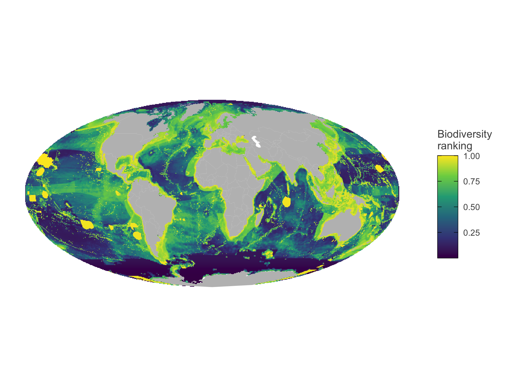

On the other hand, we need to quantify the costs associated to each pixel. An often-cited cost of implementing MPAs is that of losses in fisheries revenues \citep{smith_2010}. In this case, we define costs as losses in fisheries landings ^[I intend to use losses in fisheries revenues in the future. This will involve species-level changes in landings, as well as species-level price data. Essentially, the global losses in landings used here will be weighed by species price data.]. Since protection of some areas may lead to rebuilding fisheries, parts of the ocean might have negative costs. This means that there are gains to be made in conserving them. A map of global costs of conservation is shown in Figure \ref{fig:landing-losses}. As before, these data do not consider the transient dynamics, and represent the equilibrium state of protecting any given pixel.

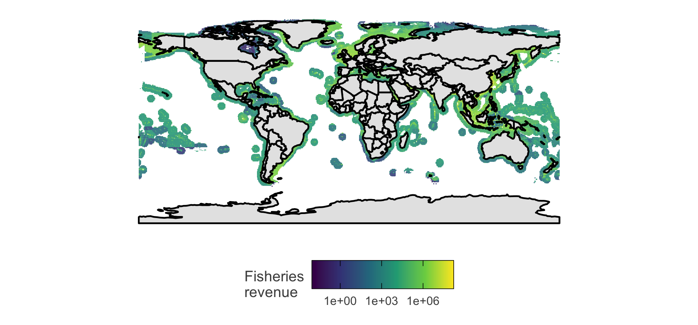

\FloatBarrier

## Building supply curves

Although there are important caveats, these data provide us with a way of calculating the costs and benefits of protecting any place under a nation's jurisdiction. While protecting the high seas may provide many benefits \citep{white_2014, sumaila_2015}, our market-based approach requires enforceable property rights, such as those offered by Exclusive Economic Zones. Moreover, biodiversity benefit is higher within Exclusive Economic Zones, where most of the species live \citep{mayorga_2020}. Therefore, we will ignore areas beyond national jurisdiction.

The next step is to identify which areas to protect. For two grid cells that provide equal biodiversity benefit, which one should be prioritized? This prioritization exercise need not be too complicated. We can assume that even if a country is seriously committed to conservation, costs must still be minimized. The most efficient thing to do is to protect the one that minimizes costs while maximizing biodiversity benefits. Therefore, we must calculate the benefit-cost ratio of each gridcell:


$$
BCR_i = \frac{B_i}{C_i}
$$

Where $B_i$ corresponds to the biodiversity benefit associated with protecting cell $i$, and $C_i$ corresponds to the costs of protecting cell $i$. We can do this calculation globally, and produce a map of BCR (Figure \ref{fig:bcr-map}). Due to the possibility of negative costs, the BCR may be negative. We must therefore differentiate the BCR of cells with negative and positive costs, and rank them in this nested way.

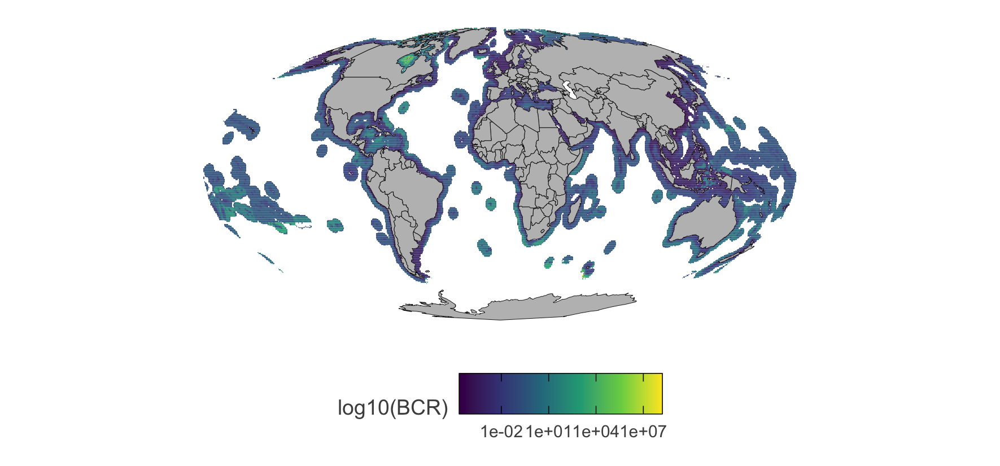

For each country, we can rank the grid cells by their BCR and calculate the total biodiversity benefit and total costs of achieving that benefit. But more importantly, we can calculate the marginal costs (defined as the cost of protecting an extra unit of biodiversity: tonnes of fish lost / benefit unit), and produce a supply curve of conservation for each country. Their shape suggests that the first few units of conservation can be achieved at relatively low costs, but that it becomes increasingly costly to obtain more and more biodiversity benefits. Figure \ref{fig:eez-supply-curve} shows the biodiversity supply curves of each country, and the horizontally-summed global supply curve.

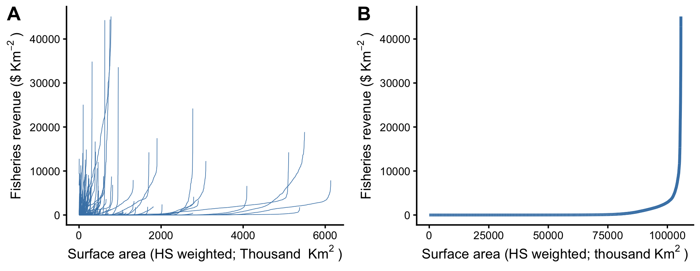

## Finding targets and trading price

<!-- MAYBE:: A meta-analysis of simulation studies suggests that targets ranging from biodiversity protection to food provisioning can be indeed achieved by protecting ~30% of our coastal oceans \citep{oleary_2016,cabral_2019}. However, these area-based targets ultimately imply a desired level of biodiversity benefit. -->

The supply curves above will tell us the per-unit-costs of achieving a given amount of biodiversity benefit. But what is this "desired" amount of biodiversity benefit? All conservation targets are area-based, and do not explicitly call for an amount of conservation such as "protect 20 species", or "protect 3 habitats". However, we know the costs and benefits of each grid cell. This allows us to anticipate how rational nations may translate their area-based requirements into conservation interventions.

Figure \ref{fig:eez-supply-curve-approaches} shows five possible ways in which nations may reach an area-based target. Each panel shows the amount of biodiversity benefit produced by protecting a given percentage (x-axis) of a nation's EEZ. The only difference between panels is the strategy taken by nations, which leads to different curvatures. In the first panel, labeled as "efficient", nations conserve area in decreasing BCR values. The second panel maximizes conservation, and nations protect based on the biodiversity benefit rankings and completely ignore the costs. Similarly, the third panel seeks to maximize costs only, without accounting for how much conservation is achieved. The last two panels do the opposite, and try to minimize conservation or costs, without accounting for the other. The scenarios where costs are maximized or biodiversity benefits minimized are of course unlikely, however they provide bounds for where the true target lies. From now on, we will move forward with he efficient target of achieving 72 units of biodiversity benefit.

The most efficient way to achieve this level of conservation is by prioritizing places with a higher BCR. We can take the horizontally-summed global supply curve of biodiversity and find the corresponding costs for each of the benefit targets identified above (Figure \ref{fig:global-conservation-targets-and-trading-prices}). This values are also known as the trading price. A nation will continue to conserve in-situ up until the cost of an additional unit of conservation is equal to this value. Instead, it is more cost-effective to conserve elsewhere in the world where the costs are lower.


\bibliography{references}