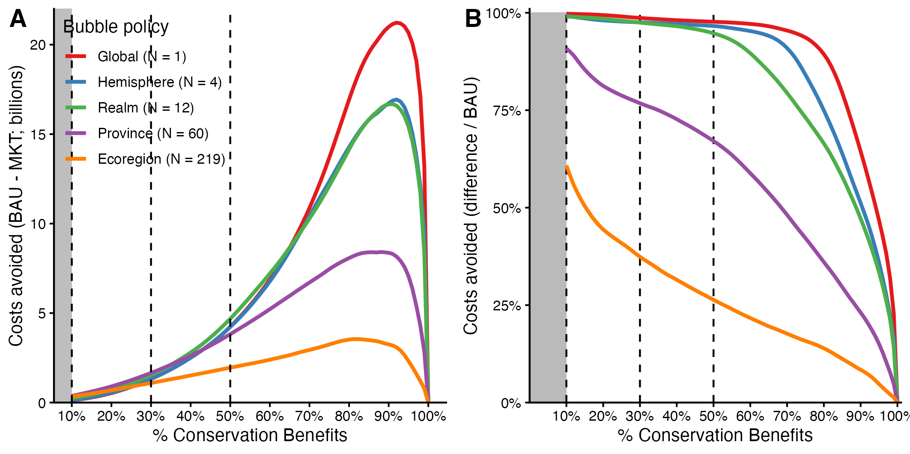

```{r setup, include=FALSE}
knitr::opts_chunk$set(echo = FALSE,
                      warning = FALSE,
                      message = FALSE,
                      fig.pos = "!H",
                      out.extra = "")
```

\clearpage

<!-- # Important sentences -->

<!-- Importantly, the quality of a patch can be defined independently of other pixels. This is true for habitat suitability, in which the abiotic characteristics that determine the suitability of a patch are independent of the protected status of any patch. -->

<!-- It is important that we acknowledge the equity concerns of any conservation intenrvention. Under the current approach to conservation, nations face two options: to conserve 30% in situ, or not engage in conservation at all. This market-based approach allows for a third option: it allows nations to decide how much to conserve in their waters. -->

<!-- Ocean grabbing, the term that relates to the loss of soveraignty in the ocean (see Benett) may be perceived as a problem. However, nations are not forced to conserve in situ, and will only do so if they are approrpiately compensated for it. -->

<!-- All ecosystems are euqlly important for the subsistance of nature and species that reside in them. But a coral reef is not comparable to a kelp forest.  A market design that doesn't acknowledge these differences may unintendendly bias conservation towards different ecosystems or geographic regions. When outcomes of a market are restricted to a geographic extent, such as air pollution markets, a buble policy is implemented. We borrow from this principle and use biogeographic regionalization principles to create ecologically-coherent market segments where nations trade similar habitat. For example, in the temperate eastern pacific, Mexico and the US will trade a same type of habitat, while in the Tropical Atlantic they wil. -->

<!-- Having tackled these three limitations (spatially-independent measure, x, and market bubbles), we proceed to simulate the trade outcomes of such a market. We evaluate the outcomes across a range of target coverages (1 - 100), and find that a market always results in reduced costs. The absolute and relative magnitude of the costs-savings changes with protection target, peaking at between X and Y, depending on of the choice market segmentation. Intuitively, increasing teh number of market segments reduces the opportunity for bargaining and reduces the gains from trade, but ensures the persistance of different habitats. -->

<!-- We pay especial attention to goals of interest, such as protecting 30% of the marine area (habitat suitability-weighted) within all national jurisdictions. We find that a market-based approach to conservation would reduce costs by X%, and that Y% less area would be needed. -->

# Main

More than three decades of conservation science have shown us that well-designed Marine Protected Areas (MPAs) can deliver large economic and ecological benefits\cite{halpern_2008,cabral_2019, cabral_2020}. Various international goals seek to protect anywhere between 10\% and 30\% of the global ocean with MPAs.  Along with these commitments, the scientific roadmap on where to site them\cite{roberts_2002,worm_2003,lucifora_2011,wallace_2011,albouy_2017,sala_2021} should be enough to see these goals realized. Why, then, have some nations achieved (and even surpassed) the ambitious 30\% target, while others lag behind even the modest 10\% target? Partly, because under the current unilateral conservation framework some nations face higher costs of conservation than others. Here, we show how an environmental market can be designed to lower the costs of conservation and induce cooperation towards a more efficient and equitable protection of the marine environment.

Habitat suitability, and the costs of protecting it, are heterogeneously distributed across the globe \cite{halpern_2008,roberts_2002,kroodsma_2018}. As a result, different nations can attain the same amount of conservation for dramatically different costs, questioning the efficiency and equity of the current unilateral approach to marine conservation. But what if there were a way to maximize global conservation while lowering national costs of conserving? We propose a new institution where nations facing large costs of conserving in their Exclusive Economic Zones (EEZ) can purchase conservation credits from nations with a surplus of habitat worth protecting, and show that the costs of conservation can be dramatically reduced.

The latest work on marine conservation prioritization shows that a globally coordinated effort to conserve the ocean is more efficient than unilateral conservation efforts\cite{sala_2021}. While these results highlight the importance of coordination and identify where protection is warranted, they are not enough to incentivize nations. But how can we induce cooperation on globa marine conservation? One way to induce this desired cooperation is by giving nations the option to meet their conservation targets *in situ* (\emph{i.e.} within their EEZ) or pay to conserve *ex situ* (\emph{i.e.} in another nation's EEZ, who have a surpluss of area to conserve).

A market for conservation credits would allow just that. However, in designing such a market, two main challenges arise. First, not all ecosystems are created equally. Protecting one hectare of coral reef is not the same as protecting one hectare of kelp forest. A conservation market that ignores this could inadvertently fail to protect important habitat. Secondly, we live in a highly dynamic and connected world, one in which the biodiversity and costs of a patch of ocean depend on what else has been (or will be) protected, as well as it's own protection status. We provide solutions to both of these problems, and then simulate the trade outcomes of a global market for marine conservation credits and compare them to the business-as-usual baseline of unilateral conservation. For a range MPA coverage targets (1\% - 99\%), we find that a market always reduces the cost of conservation, resulting in a more efficient and equitable outcome.

# Spatial heterogeneity

The motivation from a market-based approach to conservation relies on two premises. First, that habitat worth protecting is heterogeneously distributed across nations. And, secondly, that the costs of protecting habitat are non-perfectly correlated with the protection value of the pixel and are thus also heterogeneous in space. Together, these two features make it possible to lower costs of conservation by using trade to protect the most cost-effective places. The magnitude of market gains (that is, cost savings relative to BAU unilateral conservation with no trade) will depend on the spatial distribution of costs and benefits. To illustrate this point, we generate synthetic data to simulate girded worlds where the conservation value of a pixel is heterogeneously distributed, and where costs and benefits exhibit different correlation coefficients (R from -1 to 1; See methods for a detailed description on synthetic data generation). For each scenario, we calculate the gains from trade for a series of protection targets (1 - 100%). We find that unless the costs and benefits are spatially homogeous and perfectly correlated (\emph{i.e.} R = 1), a market will always lower the costs of conservation for any desired target.

# Designing a market for conservation credits

Unlike the synthetic world described above, our planet contains a diverse array of different ecosystems, all of which are worth protecting. The first challenge in designing a market for conservation credits is to ensure that all ecosystems are properly protected. A colorful coral reef can not be substituted for a productive kelp forest - they complement each other to produce our world's rich biodiversity. How then, do we ensure that a market does not bias protection to one ecosystem or the other? A potential solution is to use a "bubble policy" \cite{fr_1979}. First introduced in air quality management, this approach enables polluting plants to flexibly manage their air emissions. By placing a “bubble” over a city with multiple polluting plants and applying a single emission cap to the “bubbled” city, each plant can decide how to internally manage production and trade emissions permits accordingly.

We use biogeographic regionalization (Realms and Provinces \cite{spalding_2007} Fig S1) to create ecologically-coherent "blue bubbles" where nations trade conservation credits for similar habitats. For example, for Realm-based bubbles, Mexico and the United States trade conservation credits under two blue bubbles (Temperate Eastern Pacific [TEP] and Tropcial Atlantic [TA]), using bubble-specific conservation credits (\emph{e.g.} Kelp forest in the TEP and coral reefs in the TA).

The second challenge a market faces is defining conservation targets. In the air quality example, the target can easily be set to be an amount (\emph{e.g.} tons of CO2) or ambient concentration (\emph{e.g.} ppm) of a pollutant, both of which are measurable quantities. An important feature is that the amount of pollution in one bubble can be determined independently of the management and amounts of pollution in adjacent bubbles. However, biodiversity is an elusive variable with multiple nuanced indices that implicitly assign weighs to different features (\emph{e.g.} species richness ignores abundance, while biomass ignores richness). Moreover, the biodiversity for any pixel in the world will be influenced by the protection status of said pixel, but also the network of connected pixels. The network of MPAs required to contain 100 species may not nessesarily be a subset of the network required to protect 101 species.

To work around this problem, we define the value of a pixel based on its surface area and the suitability of the habitat it contains for the species distributed there. Habitat suitability is defined as the joint probability of encountering a species, conditional on th abiotic characteristics of a pixel (\emph{e.g.} salinity, temperature, productivity, depth). We use habitat suitability maps for 4,000 **(exact number here)** marine species \cite{ready_2010} to calculate average suitability across all species. Conveniently, the habitat suitability of any pixel in the ocean can be defined independently of the habitat suitability and protection status of all other pixels. Moreover, Marine Protected Areas are spatial conservation interventions that seek to directly protect habitat and, indirectly, the species that reside there. The siting of MPAs can therefore be guided by abiotic characteristics that are conducive to the persistence of species.

To provide a working example of a market for conservation credits, we must define costs. The real world is unlikely to exhibit perfect correlation between costs and benefits of conservation. We use spatially explicit data ob average fisheries revenue (2000 - 2015) \cite{melnychuk_2017,sumaila_2007,swartz_2013}. MPAs may certainly have positive impacts on fisheries revenue. Instead, our use of mean fisheries revenue should be interpreted as a proxy for the short-term political cost of displacing fishers, even if those same fishers might be better off in the future \cite{cabral_2020, cabral_2021}. In practice, the deffinition of costs will include other considerations, and may even vary from nation to nation. Special attention is given to this in our discussion section.

# Results

We simulate with syntthetic data, and then provide an example of an operationalization of the concept. We present results for blue bubbles defined by biogeographic realms, but our suplementary materials present results for provinces, hemispheres, and oceans. We then focus our attention on the often-cited target of protecting 30% of the world. We show the directionality of trade (who pays to conserve and who gets paid to conserve), a comparision of area that would be protected under either or both scenarios. Lastly, we explore whether a realm-based market results in biased conservation for different taxa.

Our simulation with synthetic data, where the correlations and distributions are known, shows that gains from trade are positive so long as costs and benefits are not perfectly correlated. Importantly, the gains from trade grow as spatial concordance decreases. This is an important insight, because it suggests that unless the real world exhibits perfect correlsation, there are potential gains frome trade.

## Operationaling of a conservation credit market

We combine habitat suitability and fisheries revenue to generate supply curves for each nation, with markets ipperating under five different bubble policies (global, hemisphere, realm, sea, and province). Since benefits and costs are not perfectly correlated (fig X with corr betwieen habitat suitability and fisheries revenue), we find that trade always results in cost-savings. Increasing the number of bubbles reduces market gains, because there is less opportunity for trade. Increasing the number of constraints often limits win-wins \cite{burgiuess_2021}.




Each target protection level has a distinct market equilibrium. The following sections focus on the often-cited conservation target of protecting 30% of the oceans. For the purpose of the main text, we focus on the case where bubbles are defined by realms. We find that in every realm, there are at least two nations engaging in trade. This is important, because it shows that the results are not driven by trade ocurring in just one realm. The trading status of each nation in is shown globaly in figure \ref{fig:map-of-trade} and for each realm in figure \ref{fig:rlm-map-of-trade}.


A pervasive finding on environmental markets is that market forces can lead to conglomeration of rights. In this case, this could be interpreted as one nation holding all effective conservation, or one nation not conserving at all. To test for conglomeration, we compare the MPA networks created by the market and BAU scenarios. Figure \ref{fig:two-states-map} shows the four possible categories for all pixels in the world: protected under BAU and market scenarios, protected only under BAU, protected only with a market, and not protected at all. We find no conglomeration.


The spatial configuration shows no bias. But the aggregagate results may mask defficient protection for some taxa. Figure X shows the the density distribution of % habitat protected for each major taxa, under a market and BAU scenario with a 30% protection target. We find no evidence of bias in protection status between or within taxa groups. As with customary MPA implementation, more targeted policy interventions will be necessary for particularly vulnerable species (\emph{e.g.} harvest bans, export bans).


<!--  -->


<!-- # Simulations -->


<!-- The same approach can then be repeated for any level of spatial aggregation. As an example, I repeat the conservation excercise by subdividing the world into 12 Realms, and calculate realm-level supply curves to estimate the trading price for all countries that are part of that market. -->

<!-- The following sections go into more detail to describe my methods. The first section describes the data, and important caveats are mentioned at this stage. The second section describes how nation-level and aggregate supply curves were built. The third section dives into translating area-based targets into biodiversity benefit targets and the corresponding trading prices. Finally, we discuss how the analysis can be replicated by creating markets at different spatial scales. -->

<!-- ## Spatial considerations -->

<!-- When combining different data sources, we also include pixel-level information about the Hemisphere, Realm, Province, and Ecoregion in which they reside. This allows us to repeat the exercise of finding supply curves for any level of spatial division in order to simulate markets within them. This is better described in the results section, where I present detailed methods and results in parallel. -->

<!-- # Results -->

<!-- The main purpose of this project is to identify the gains from trade. But in order to get there, there are other minor findings that are worth mentioning here. This sections presents some preliminary results. The first section shows findings for a global market, where I calculate the gains from trade for a given target and it's corresponding trading price. I then turn to the realm-level markets, and present the same information for each realm. Whenever relevant, I mention opportunities for improvements, and I later discuss them in the discussion section. -->

<!-- ## Global -->

<!-- By combining costs and benefits of conservation and anticipating the ways in which countries may conserve within their waters, we can translate the (percent) area-based targets into biodiversity benefit targets. We find that a 30% target yields a global biodiversity benefit of 3 to 106, depending on the approach taken (Figure \ref{fig:eez-supply-curve-approaches}; Table \ref{tab:trading-prices}). -->


<!-- \newpage -->

<!-- In translating the area-based target into a biodiversity benefit target we identified the global conservation benefits, but also the costs to each nation (Figure \ref{fig:equilibrium-supply-curves} left). We can use the nation-level supply curves and trading price to find the market's equilibrium for conservation (Figure \ref{fig:equilibrium-supply-curves} right). Under a market-based approach, in-situ conservation will decrease for some nations (those for which costs are higher than the trading price), while some may see increased in-situ conservation (those under the trading price). The additional conservation in some nations (red lines in Figure \ref{fig:equilibrium-supply-curves}) can only be achieved through a market, where nations whose in-situ conservation would exceed the trading price are willing to pay to conserve elsewhere. -->

<!--  -->

<!-- By knowing the equilibrium under each approach we can compare the total costs and calculate the gains from trade. We find that a market-based approach can produce the same biodiversity benefit of 71.56 units for just 54% of the costs (Table \ref{tab:gains-from-trade}). Of course, gains from trade are heterogeneously distributed among nations. The map below (Figure \ref{fig:map-of-trade}) shows which countries would rather pay to conserve elsewhere, and which countries get paid to conserve in-place. Figure \ref{fig:two-states-map} shows the outcome of each approach. -->

<!-- \input{results/tab/gains_from_trade.tex} -->


\newpage

<!-- ## Realms -->

<!-- The results presented so far assume that a unit of biodiversity is worth the same anywhere around the world. However, we might want to ensure that no single type of habitat or region is left out. To overcome this, markets can be established at different spatial scales. Here, we use different scales of zoning in the marine environment (*i.e.* Biogeographic zoning). \cite{spalding_2007} divided the oceans using a hierarchical approach with Realms (n = 12) containing Provinces (n = 60), which in turn contain Ecoregions (n = 219). -->

<!-- The same approach as above can be repeated for any level of spatial aggregation that allows for more than one country. For example, this can be done for each of the 12 realms (Figure \ref{fig:realm-map}). Each Realm contains more than one nation, which would allow for trade to occur (Figure \ref{fig:eezs-per-realm}). For example, the Tropical Atlantic contains more than 60 nations, while Temperate Australasia contains just three. Any given country may also be part of more than one realm (Figure \ref{fig:realms-per-eezs}). For example, Mexico is present across four realms (Tropical Eastern Pacific, Temperate Northern Pacific, Temperate Northern Atlantic, and Tropical Atlantic). -->

<!-- As done before for the global analysis, we can generate the biodiversity supply curves of each country-realm combination, and calculate the realm-level supply curve for biodiversity benefit. Then, for any desired level of biodiversity benefit, we can estimate the realm-specific trading price, and derive the market equilibrium. From there, we can estimate the gains from trade, and identify who gains from this approach. -->

<!-- We first must find the target amount of biodiversity. We do this by finding how much biodiversity would be protected if every country were to protect 30% of each realm present within their Exclusive Economic Zone ^[This is more closely aligned with what the IUCN 30% target is: the International Union for the Conservation of Nature (IUCN) has suggested that at least 30% of each marine habitat should be protected in areas with no extractive activities.]. We then sum the realm-level biodiversity to obtain the aggregate biodiversity (Table \ref{tab:rlm-trading-prices}). Using the realm-level supply curves (Figure \ref{fig:eez-rlm-supply-curve} bottom) we can identify the trading prices. When the market is segmented by realms, a market approach produces the same amount of conservation for just 65.2% of the costs in the BAU scenario. The realm-level gains from trade for such a market are shown in Table \ref{tab:rlm-gains-from-trade}, and Figure \ref{fig:rlm-map-of-trade} shows the realm-level transactions. Note how for the Temperate Northern Pacific Mexico gets paid to conserve, while in the Tropical Atlantic it pays to conserve elsewhere. -->


<!-- So far, I have performed preliminary analyses for a global market and outlined how it would be done for 12 realms. I believe there is room (and need) to try a few more approaches. The first approach would involve "zooming out" to create four markets, one for each hemisphere. The second approach would then increase the scale by repeating the exercise for each ocean basin. Then, I would further increase the scale by taking the market at the province-level (Figure \ref{fig:eezs-per-province}). Doing it at the ecoregion-level (the next biogeographical scale) would yield less benefits from trade, since many Ecoregions contain only one nation. I expect gains from trade to decrease as spatial resolution (or segmentation of the markets) increases. In the end I will have six levels of spatial aggregation: global, hemisphere, ocean, realm, province, and EEZ (BAU).  -->


\newpage

# Other figures and tables


\clearpage

# Supplementary Information

Bubbles


## Data description

We must first identify the costs and benefits of conservation. Conserving biodiversity may provide benefits to society. For example, areas with higher species richness and biomass are more attractive to tourism \cite{williams_2000}. Species richness also leads to increased stability of ecosystems \cite{tilman_1995}, and may reduce exposure to pathogens \cite{lamb_2017}. The quantification is not straightforward, but we can assume that biodiversity indices are positively correlated with their benefits they provide (although saturation may occur past a given point).

I use spatially-explicit data on biodiversity benefit for each 50 X 50 km grid in the ocean. The score was derived to account for species richness and evolutionary distinctiveness, but also presence of topographic features (*e.g.* sea mounts). Figure \ref{fig:biodiversity-ranking} shows a global map of these values. The value of a given pixel (termed $\Delta v$) depends on previously protected pixels. As such, the value of a randomly chosen pixel is more or less meaningless. However, the configuration represented in Figure \ref{fig:biodiversity-ranking} was derived to maximize biodiversity. Therefore, protecting the best $n$ pixels and summing their values does represent the total amount of biodiversity protected. The same exercise has been done at the country-level (This is an important consideration for target calculations mentioned below. While I will use this global data for the purposes of motivating my approach, I do plan on using the appropriate data in my final work.)


On the other hand, we need to quantify the costs associated to each pixel. An often-cited cost of implementing MPAs is that of losses in fisheries revenues \cite{smith_2010}. In this case, we define costs as losses in fisheries landings ^[I intend to use losses in fisheries revenues in the future. This will involve species-level changes in landings, as well as species-level price data. Essentially, the global losses in landings used here will be weighed by species price data.]. Since protection of some areas may lead to rebuilding fisheries, parts of the ocean might have negative costs. This means that there are gains to be made in conserving them. A map of global costs of conservation is shown in Figure \ref{fig:landing-losses}. As before, these data do not consider the transient dynamics, and represent the equilibrium state of protecting any given pixel.


\FloatBarrier

## Building supply curves

Although there are important caveats, these data provide us with a way of calculating the costs and benefits of protecting any place under a nation's jurisdiction. While protecting the high seas may provide many benefits \cite{white_2014, sumaila_2015}, our market-based approach requires enforceable property rights, such as those offered by Exclusive Economic Zones. Moreover, biodiversity benefit is higher within Exclusive Economic Zones, where most of the species live \cite{sala_2021}. Therefore, we will ignore areas beyond national jurisdiction.

The next step is to identify which areas to protect. For two grid cells that provide equal biodiversity benefit, which one should be prioritized? This prioritization exercise need not be too complicated. We can assume that even if a country is seriously committed to conservation, costs must still be minimized. The most efficient thing to do is to protect the one that minimizes costs while maximizing biodiversity benefits. Therefore, we must calculate the benefit-cost ratio of each gridcell:


$$
BCR_i = \frac{B_i}{C_i}
$$

Where $B_i$ corresponds to the biodiversity benefit associated with protecting cell $i$, and $C_i$ corresponds to the costs of protecting cell $i$. We can do this calculation globally, and produce a map of BCR (Figure \ref{fig:bcr-map}). Due to the possibility of negative costs, the BCR may be negative. We must therefore differentiate the BCR of cells with negative and positive costs, and rank them in this nested way.


For each country, we can rank the grid cells by their BCR and calculate the total biodiversity benefit and total costs of achieving that benefit. But more importantly, we can calculate the marginal costs (defined as the cost of protecting an extra unit of biodiversity: tonnes of fish lost / benefit unit), and produce a supply curve of conservation for each country. Their shape suggests that the first few units of conservation can be achieved at relatively low costs, but that it becomes increasingly costly to obtain more and more biodiversity benefits. Figure \ref{fig:eez-supply-curve} shows the biodiversity supply curves of each country, and the horizontally-summed global supply curve.


## Finding targets and trading price

<!-- MAYBE:: A meta-analysis of simulation studies suggests that targets ranging from biodiversity protection to food provisioning can be indeed achieved by protecting ~30% of our coastal oceans \cite{oleary_2016,cabral_2019}. However, these area-based targets ultimately imply a desired level of biodiversity benefit. -->

The supply curves above will tell us the per-unit-costs of achieving a given amount of biodiversity benefit. But what is this "desired" amount of biodiversity benefit? All conservation targets are area-based, and do not explicitly call for an amount of conservation such as "protect 20 species", or "protect 3 habitats". However, we know the costs and benefits of each grid cell. This allows us to anticipate how rational nations may translate their area-based requirements into conservation interventions.

Figure \ref{fig:eez-supply-curve-approaches} shows five possible ways in which nations may reach an area-based target. Each panel shows the amount of biodiversity benefit produced by protecting a given percentage (x-axis) of a nation's EEZ. The only difference between panels is the strategy taken by nations, which leads to different curvatures. In the first panel, labeled as "efficient", nations conserve area in decreasing BCR values. The second panel maximizes conservation, and nations protect based on the biodiversity benefit rankings and completely ignore the costs. Similarly, the third panel seeks to maximize costs only, without accounting for how much conservation is achieved. The last two panels do the opposite, and try to minimize conservation or costs, without accounting for the other. The scenarios where costs are maximized or biodiversity benefits minimized are of course unlikely, however they provide bounds for where the true target lies. From now on, we will move forward with he efficient target of achieving 72 units of biodiversity benefit.

The most efficient way to achieve this level of conservation is by prioritizing places with a higher BCR. We can take the horizontally-summed global supply curve of biodiversity and find the corresponding costs for each of the benefit targets identified above (Figure \ref{fig:global-conservation-targets-and-trading-prices}). This values are also known as the trading price. A nation will continue to conserve in-situ up until the cost of an additional unit of conservation is equal to this value. Instead, it is more cost-effective to conserve elsewhere in the world where the costs are lower.


\bibliography{references}